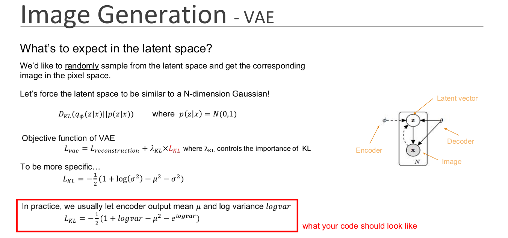
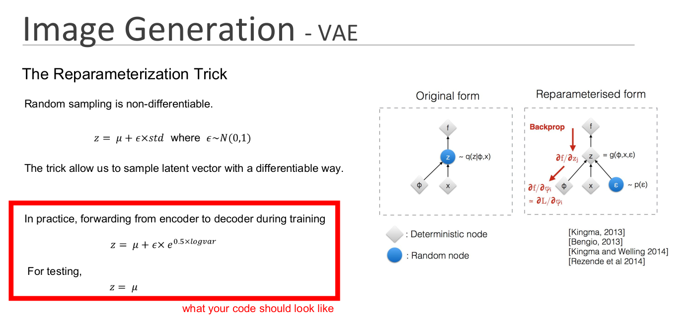

# Variational-Autoencoder-for-images
VAE implemented with PyTorch

## Introduction
  
  In this repo, AE(Auto Encoder) and VAE(Variational Auto Encoder) are implemented, 
  and are experimented with different model structures and super parameters.
  
  All models are under ```models/``` 
  Process of training are recorded and put under ```logs/```
  Prediction images are put under ```prediction/```
  All experiments are listed in ```experiment.sh```, relation between files can be found in it.

## Dataset
 
 * [Download link](https://drive.google.com/file/d/1nByd2L5KokSI3BLO6y7BmeS3B6wJeFrF/view?usp=sharing)

 **train/** folder is used for training, **test/** is used for validation/testing
 all images are humen faces, in size of 64 * 64
 > Edit the path to the dataset in main.py

## Variational Loss

  The difference between AE and VAE is the **Variational Loss**, which make the latent 
  vector become Nornal distribution, thus can generate random faces by sampling on the 
  latent vector. Below is for reference:
  
  

## Reparameterization Trick

  

## Result

  All the result can be found under **prediction/** folder
  The example below are results of experiment **vae_01_05**

  ### Reconstruction

face 1 | face 2 
------ | ------ 
 123   | 4568


  ### Random Sampling

## Conclusion