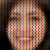
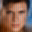
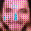
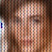
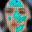
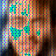
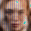
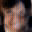

# Variational-Autoencoder-for-images
VAE implemented with PyTorch

## Introduction
  
  In this repo, AE(Auto Encoder) and VAE(Variational Auto Encoder) are implemented, 
  and are experimented with different model structures and super parameters.
  
  All models are under ```models/``` 
  Process of training are recorded and put under ```logs/```
  Prediction images are put under ```prediction/```
  All experiments are listed in ```experiment.sh```, relation between files can be found in it.

## Dataset
 
 * [Download link](https://drive.google.com/file/d/1nByd2L5KokSI3BLO6y7BmeS3B6wJeFrF/view?usp=sharing)

 **train/** folder is used for training, **test/** is used for validation/testing
 all images are humen faces, in size of 64 * 64
 > Edit the path to the dataset in main.py

## Variational Loss

  The difference between AE and VAE is the **Variational Loss**, which make the latent 
  vector become Nornal distribution, thus can generate random faces by sampling on the 
  latent vector. Below is for reference:
  
  

## Reparameterization Trick

  

## Result

  All the result can be found under **prediction/** folder
  The example below are results of experiment **vae_04_01**

  ### Reconstruction

face 1 | face 2 | face 3 | face 4 | face 5 | face 6 | face 7
------ | ------ | ------ | ------ | ------ | ------ | ------
 |  |  |  |  |  |  
 |  |  |  |  |  |  

Fist row is original image from testing data, the second row is corresponding reconstruction images.

  ### Random Sampling

face 1 | face 2 | face 3 | face 4 | face 5 | face 6 
------ | ------ | ------ | ------ | ------ | ------ 
 |  |  |  |  |  

The images are sampled in the latent vector, however, the results are quite terrifying

## Conclusion

* Sigma KL size is a trade-off between "Reconstruction quality" and "Random sampling quality"
* The differnt ways ro reparameterize could cause interesting result (look results for vae_01 & vae_02 )
* The distribution of the latent vector is very important for sampling quality 

## Useful References

* [Intuitively Understanding Variational Autoencoders](https://towardsdatascience.com/intuitively-understanding-variational-autoencoders-1bfe67eb5daf)
* [Variational Autoencoders](https://www.jeremyjordan.me/variational-autoencoders/)
